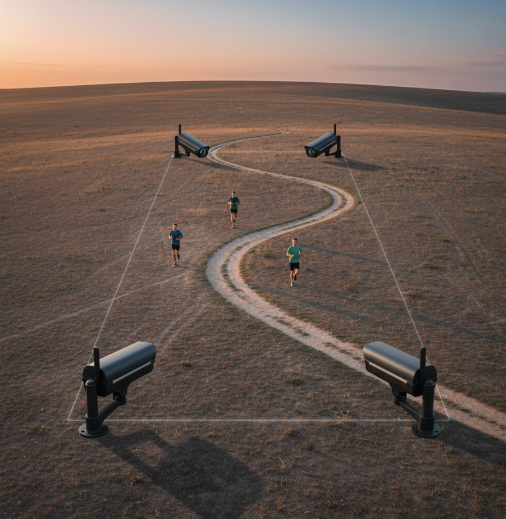

# BIB RECOGNITION MULTICAMERA 🏃🏻‍♂️📹 
Davide Ermellino - Università degli studi di Cagliari

This is a little guide to use all the functionality of my work here in Las Palmas
about the recognition of bib number on multicamera view.

The work is divided in two part benchmarked of existing OCR models on RBNR dataset and prediciton of bib number of runners with multipleview videos

## BENCHMARK 📊 

At first I benchmarked some OCR to the RBNR dataset, if you want to
reproduce the results you can go to the folder *benchmark*, there you will find one notebook for each
OCR tested, they are wrote to be executed without any additional effort, just execute the cells ( also the dataset is downloaded there). 
If you want to edit the parameters you can do it in one of the first cell of each notebook.

## BIB PREDICTION 

After benchmarking the OCR I started to work with some videos. All the work is in the *analyze_vide_data* folder.

The videos I worked on are shows a part of a trail run in Gran Canaria. 
For this project 4 cameras has been used, one on each vertex of a recangle

  
  

For each camera i extract information for each frame about the runners present in the video,
in this way i don't need to work with the video anymore. To do so, have a look at the *analyze_video_runner.ipynb* notebook

Since we have 4 camera a reidentification system is needed, i divided this process in 2 part. 
The first one is the reidentification between the frontals and the rears camera. You can use reproduce this 
executing the notebook called *runner_reidentification_1.ipynb*.
After that i do the reidentification between the frontal and the rear result of the previous reidentification. 
You can reproduce it executing the notebook called *runner_reidentification_2.ipynb*.

now we have the result for each runner, you can have a look at them ont the directories *set_videos_n*.
to see the result plotted i created the notebook *Plot_results.ipynb*

the final structure of the project is
